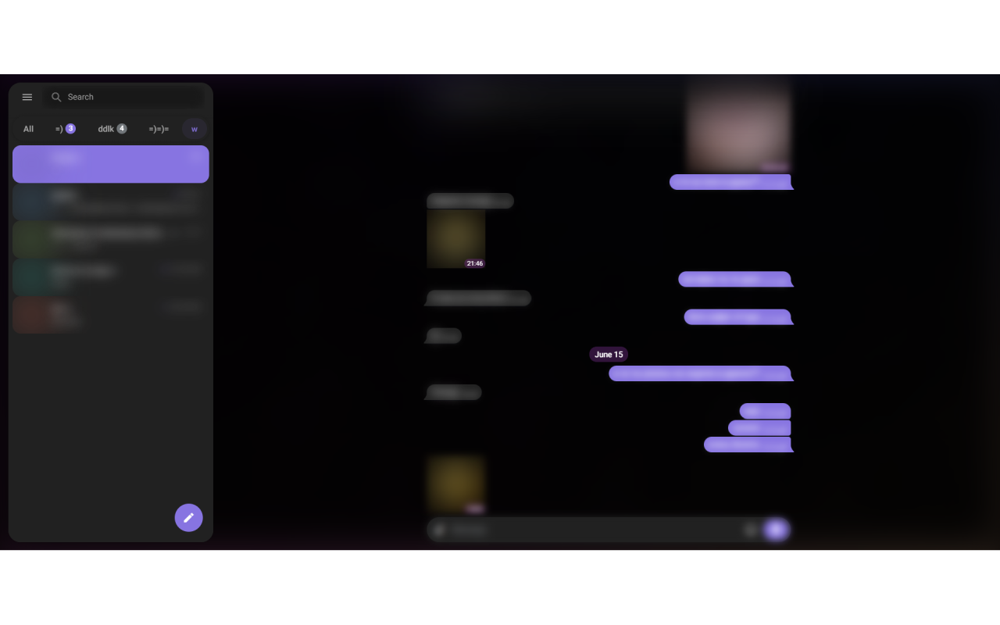
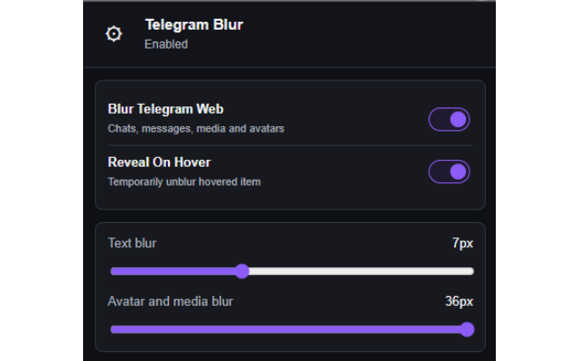

# Telegram Blur

Extension for blurring private Telegram Web content, including chats, messages, media, and avatars.

## Features

- Blur Telegram Web chat list, messages, media, names, and avatars
- Toggle blur from the popup or with a configurable in-page shortcut
- Configure blur strength and reveal behavior
- Automatically enable blur after an inactivity timeout
- Keep all settings local to the browser

## Supported Pages

- `https://web.telegram.org/*`

## Privacy

- Settings are stored locally in the browser
- The extension does not read, collect, or send Telegram messages to external servers

## Installation

- 🟢 [Chrome Web Store](https://chromewebstore.google.com/detail/pjjpgecmhadoebhgkfcnlljmmonoakap)
- 🦊 [Firefox Add-ons](https://addons.mozilla.org/firefox/addon/telegramblur/)

## Screenshots

**1. Telegram Web with private chat content blurred**

**2. Blur strength, reveal behavior, and shortcut settings**

## Contributing

Feel free to open issues or submit pull requests to improve the extension.
